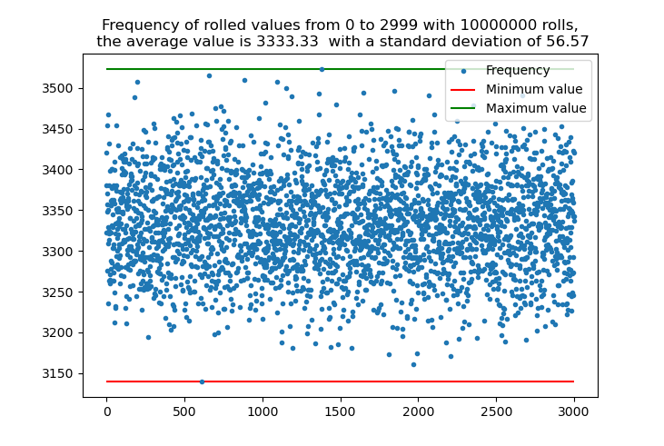

# Rolling dice to generate seed phrases

This proposed **experimental** method is an analog way of using dice to generate random seed phrases for bitcoin wallets. This proposed method uses six sided dice in an analog random way, as an alternative to the seedpicker.net way that draws raffle tickets out of a hat, described here [https://seedpicker.net/guide/GUIDE.html](https://seedpicker.net/guide/GUIDE.html). 

Both methods use a system of getting a random result by a physical action and then finding seed words by looking up in a table. If you prefer rolling dice over cutting out pieces of printed paper and drawing them out of a hat, you could consider this method. 

In both cases, the dice rolling method proposed here and in seedpicker's raffle ticket approach, you will need to calculate the 24th word in a 24 word seed phrase, as this is a checksum. Some hardware wallets calculate this for you, e.g. Coldcard, but if yours does not, you need to use a program such as [seedpicker.net/calculator/last-word.html](seedpicker.net/calculator/last-word.html). Please carefully read the excellent security advice at this seedpicker site before calculating the 24th word [https://seedpicker.net/guide/GUIDE.html](https://seedpicker.net/guide/GUIDE.html).

Below I have structured this document in the following way

- Description of the algorithm to use to generate the seed words.
- Link to relevant resources
- A part describing the mathematics of the algorithm with simulated results to increase the confidence of the reader in that the method does what it is supposed to do.

## Seven dice rolls gives a random seed word
There are 2048 possible words in the BIP39 list, see [below](#bip39), that we should draw from as many times as the seed phrase is long minus one. For a 24 word seed you need 23 random words and then a way to calculate the last and 24th word, see above. 

This method uses either seven six sided dice rolled at once or seven rolls of one die to generate a truly random number between 1 and 2048, which then gives us a truly random BIP39 word, as random as drawing the word out of a hat.

This algorithm was constructed after reading the very good tutorial on multisig bitcoin wallets [10x Security Bitcoin Guide](https://btcguide.github.io/).

### The math
There are 2048 different values to roll. This dice rolling algorithm rolls a value from zero to 2999, and if you roll zero or above 2048, you **have to** reroll. The one way this algorithm fails is if you only reroll parts of the dice when exceeding the allowed values, that way some results will be more likely than others! So I must stress that if you roll a number outside of 1-2048, you **must reroll all the dice**.

For the range from 0-2999, there are three thousand different values. This algorithm divides this number into four parts, four different numerals. The thousands, which can have values 0, 1 and 2, and the hundreds, tens and ones which each can have the values 0 to 9. 

#### Dice rolls
For the thousands part it is an easy way to roll 0, 1 or 2 using a die:

| Die roll | Results |
|----------|---------|
| 1, 2     | 0       |
| 3, 4     | 1       |
| 5, 6     | 2       |

So, if you roll one or two, the thousands is zero, three or four means thousands is one, and five or six gives you a thousands of two.

For the hundreds, tens and ones, we must construct a system of rolling the values zero through nine, ten different values. This requires using two dice. The first die roll will decide if we are in the lower or upper part of the range, 0-4 or 5-9, while the second roll gives the exact number. For the second roll, sixers must be rerolled. This time you do not have to reroll all dice so far, just this sixer.

First roll:
| Die 1 roll | Result |
|------------|--------|
| 1, 2, 3    | 0-4    |
| 4, 5, 6    | 5-9    |

Second roll:
| Die 2 roll | Results with die 1 = 1, 2 or 3 | Results with die 1 = 4, 5 or 6 |
|------------|--------------------------------|--------------------------------|
| 1          | 0                              | 5                              |
| 2          | 1                              | 6                              |
| 3          | 2                              | 7                              |
| 4          | 3                              | 8                              |
| 5          | 4                              | 9                              |
| 6          | reroll                         | reroll                         |

If the second die results in a six, reroll that one, but keep the first roll that decides if we are to have 0-4 or 5-9.

#### Rolling seven dice at once

A fast way to generate the seed phrases is by rolling seven dice at once. Then, without looking at them (so there is no subconscious bias towards any results), use a book or ruler or a similar thing to push the seven dice into a line, against for example your keyboard. Then we read off the dice from left to right:

| leftmost die - 1 | die 2      | die 3      | die 4  | die 5  | die 6  | rightmost die - 7 |
|------------------|------------|------------|--------|--------|--------|-------------------|
| Thousands        | Hundreds 1 | Hundreds 2 | Tens 1 | Tens 2 | Ones 1 | Ones 2            |

This way one can, with some practice, easily roll a seed word in one go (excepting rerolling possible sixers on the second die of the  hundreds, tens or ones). 

An example roll could be: 

|                  | die 1  | die 2  | die 3 | die 4  | die 5 | die 6  | die 7 |
|------------------|--------|--------|-------|--------|-------|--------|-------|
| example roll     | 2      | 5      | 1     | 2      | 1     | 1      | 6     |
| re-rolled sixers |        |        |       |        |       |        | 1     |
| Result           | 2 -> 0 | 5->5-9 | 1->1  | 2->0-4 | 1->0  | 1->
The0-4 | 1->0  |

The rolled number is 0100, which corresponds to word number 100 in the [BIP39](#bip39) list, which is "arrest". Voilá!

### Reroll if out of range

If the number rolled is zero or above 2048, you **must reroll all seven dice**! If you keep the thousands die of 2, and just reroll the other dice, the words 2000-2048 will be far more likely to roll than the rest, yielding an attack vector. So, please reroll everything.

Do this 11 or 23 times and calculate the last word (in a secure way!) and you have a random seed phrase.

##  BIP 39 list of words
The official list of words can be found in the bitcoin core github repository of bips [https://github.com/bitcoin/bips.git](https://github.com/bitcoin/bips.git), which you can best get by cloning the repository. 

You can also go to the file on github directly here [https://github.com/bitcoin/bips/blob/master/bip-0039/english.txt](https://github.com/bitcoin/bips/blob/master/bip-0039/english.txt) or at coldcard's github repository [https://github.com/Coldcard/wordlist-paper](https://github.com/Coldcard/wordlist-paper).

I have also included the file in this repository, simply copied from bitcoin core bips repository, [english_bip39.txt](english_bip39.txt).

All the words are numbered from 1 to 2048. You can print this and look it up with thine own eyes, or you can use your favourite program to search for the line number, e.g. emacs or firefox, however do make efforts to air-gap your computer as described in [https://seedpicker.net/guide/GUIDE.html](https://seedpicker.net/guide/GUIDE.html) if you do this on a computer. In emacs you can search by line number making for an easy lookup for each rolled number.

In order to make it easier to look up a rolled number, I have made a new text file with the numbers explicitly numbered in [english_bip39_numbered.txt](english_bip39_numbered.txt). The python script to do this is included here as well [bip39_wordlist_line_numberer.py](bip39_wordlist_line_numberer.py)

Being paranoid, it is wise to make an effort to make sure you have the correct list of words and not a tampered list.

## Entropy and randomness

Entropy is lack of order. Entropy is a function of the number of possible different states that can be accessed or that a system can have. A high entropy channel of communication will have many different states and therefore have many different possible messages to send. This was the breakthrough insight of Claude Shannon who found the way to calculate the amount of information in a system and a channel, through [Shannon entropy](https://en.wikipedia.org/wiki/Entropy_(information_theory)), finding and defining the bit that we all know and love.

Computers today usually cannot generate true random numbers. The only way for a computer without specialized hardware to find a truly random number is through reading a list of random numbers, for example derived from samples of radioactive decay or lists of numbers rolled by dice.

Random number generators are mathematical functions used by computers to generate a series of numbers that look quite random, but in fact can be reproduced. Our very own SHA256 hashing algorithm could be used for this, see this [calculator](https://xorbin.com/tools/sha256-hash-calculator). By using a string as input we get some output that looks like a random number (number in a broader sense), and by using that number as input the next time, we get a series of numbers that look random. This is the main idea of deterministic wallets, that can generate all private keys from now until eternity using one seed.

If, however, we use the same seed phrase (the first string input) we can exactly reproduce the whole sequence of numbers. This is the way computers generate "random" numbers and there are some issues with this regarding security for generating seed phrases for bitcoin.

Wallets, both hardware and software, need some "entropy" in order to start generating "random" numbers. These "random" numbers are used to generate either the private keys directly, as in bitcoin core, or the seed phrase that in turn generates as many private keys as you could want for all eternity, using the result as input for the next procedure described above. This "entropy" that is needed is a list of more random values than just "1" or the time of day, so that the list of "random" numbers that is generated is hard to replicate. If someone replicates **your** list of "random" numbers, they can generate your seed phrase and steal all your funds. 

Hardware wallets often allow you to input some random values in different ways, in order to calculate the first seed of the random number generator that in turn creates a seed phrase for you to use. On the cold card you can even roll a six sided die up to a hundred times and record each result in the device. This will give you quite a good "entropy" that could result in a very random and hard (impossible) to replicate seed phrase.

The main question of Marvin the paranoid android is always: **"but what if they compromised the code?"**.

Even if the logic behind using dice rolls or some other method could lead to perfectly good ways of defining your seed phrase, a hardware wallet could always be compromised and generate a predetermined seed phrase, and the attacker could be sitting around waiting for his retirement attack. Therefore we should generate our own seeds randomly. 

The main point of this repository is provide an analog random way of generating seed phrases as an alternative to the already existing method proposed by seedpicker: [https://seedpicker.net/guide/GUIDE.html](https://seedpicker.net/guide/GUIDE.html).

## Does it work?

In order to see that this works for myself, I wrote a python script that rolled many rolls using the algorithm here, simulating dice rolls, to make sure that all possible values were included and that no results were favourised. 

The script can be found in this repository [seedRoller_test.py](seedRoller_test.py). The results from one billion simulated rolls of seven dice can be seen below:

Each roll of seven dice yields a number from zero to 2999. The figure above shows the number of times each of those values were rolled. The average value in the figure above can be seen to be about 3333 counts for each value, which for 3000 different values multiplies up to one billion. The minimum value is not zero, which means that no values between 0 and 2999 were omitted, alle were rolled several times. 

The spread of the values, which is assessed by the standard deviation calculated in the script, but not shown in the figure, shows that this is a good spread and that no values should be favourised. Which of course is mathematically true for neutral dice, but the point of this figure is to increase our own faith in this method before entrusting our hard earned bitcoin to these newly generated private keys derived from these rolled seeds. 

## Feedback!

If you find a flaw in the algorithm or my reasoning, please do not hesitate to contact me and to comment below!
